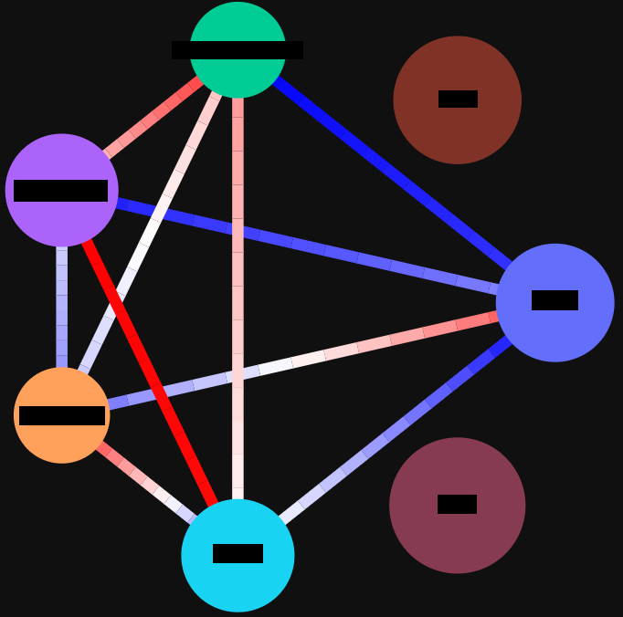

# Hi there my friend 👋

I am Rubén.

I am an Artificial Intelligence Engineer with a strong academic background in data science, telecommunications engineering, statistics, and data engineering.

I actively contribute to the field through my personal blog, where I share insights and informal experiences. With my passion and expertise in Python, machine learning, and cloud technologies, I strive to make a meaningful impact in the industry.

My daily tech stack: Python, Microsoft Azure ML, Terraform, PyTorch, Scikit-Learn, FastAPI, Pandas, Plotly.

Here you can find some of the projects I like to work on in my spare time or that I have done as part of some certification. Feel free to get inspired by them, fork them and contact me if you have any doubts or want to know a little more about the context (most of them are not thoroughly docummented since I do them mostly for myself).

Have fun.

## Projects free tour

Let me give you a brief summary of what you can find here, for free 😉

I have divided this into thes types of projects:
- Data Science/Machine Learning
- Data-oriented Software Engineering
- Software Engineering

### Data science projects

#### [Voice Cloning and Classification](https://github.com/rubchume/VoiceCloningFakeAudioDetection)
- Used an open source voice cloning model for *one-shot* cloning of voices using just a sample of one recorded sentence.
- Trained classification model for distinguising between cloned and real voices with a highly unbalanced dataset and achieving high accuracy.
- Performed the massive training and classification on compute clusters with GPU by using Microsoft Azure ML jobs.

#### [Flip page CNN detector (Microsoft Azure MLOps)](https://github.com/rubchume/FlipPageDetectorCNNAzure)
- Designed and trained a CNN neural network for classifying book pages being flipped or not with more than 98% F1 test score
- Trained it with GPU compute instance in Microsoft Azure, and PyTorch Lightning framework
- Deployed the model to Microsoft Azure ML batch and real time endpoints with the help of MLFlow framework

#### [Bank Marketing Campaign XGBoost Modeling](https://github.com/rubchume/BankMarketingCampaignXGBoostModeling)
- Analyzed data (demographic, financial and data related to marketing) from a marketing campaign where a European bank institution was selling a term deposit, performing Exploratory Data Analysis, binary classification modeling and evaluation of metrics.
- Used XGBoost to predict the success of the campaign given the customer’s available data.
- Performed feature engineering, fine tuning of model hyperparameters and adjusted the decision threshold, achieving a recall of more than 70% and a precision of 50% for a very imbalanced dataset (only 7% of customers bought the term deposit).

#### [Job candidates ranking (Word2Vec)](https://github.com/rubchume/JobCandidatesRankingWord2Vec)
- Created an algorithm to rank potential job candidates based on two criteria: search term and similarity to a candidate (based on job title, location and number of connections) that is manually highlighted as an ideal candidate.
- Used word embedding algorithms (Word2Vec and FastText) for computing the job title similarity and a geographic API for handling closeness of location.

#### [Stock Data Analysis and Trading Strategy](https://github.com/rubchume/StockDataAnalysis)
- Performed time series forecasting of stock data with SARIMAX and Simple Exponential Smothing models
- Created a trading strategy that makes use of previous forecasts using the Backtrader framework and Bollinger Bands as technical indicator

### Data-oriented Software Engineering projects

#### [Facebook Friend Network Analyser](https://github.com/rubchume/FacebookFriendNetworkAnalyzer)

This project is about **web scraping** your personal (my personal, but you should work on yours) Facebook profile using Selenium from Python.

With this you can download the information about which of your friends are friends between them, and which of them don't know each other.

Then you can find the different communities among your friends with **social network analysis** algorithms implemented in the Python library NetworkX.

The interactive visualizations are created using **Plotly**.

Finally, all of this is wrapped up in a simple (and somewhat ugly, sorry) Electron GUI that uses **Django** as a backend.

In summary, a mix of libraries and technologies to create a simple application that, honestly, I think it is really cool.

Among other things, I realized that almost all of my friends are connected.

When there is a dense network of friends (dots of the same color) that is connected by just one connection to other community,
in almost all cases the connection is a surprise you didn't know. 

For example, I discovered that a cousin of mine (my family are the violet dots) knew one of my childhood friends (green dots), and that a person I knew while studying in another country (pink) knows one of my salsa lessons classmates (yellow).

What do you think you will discover?

*You can read more in this [article](https://rubchume.medium.com/organize-your-wedding-with-social-network-analysis-in-python-aeab9d8814b3)*

#### [Picture Anonymiser](https://github.com/rubchume/PictureAnonymizer)

This is a Django application where you can upload pictures of people and then it 
uses Google Cloud Platform API for finding where the faces are.

The application will blur those faces so those pictures become anonymous.

The most interesting part of the code you can get from this is how to communicate with Google Cloud Platform from Python.

It can serve as a starting point for other more complex applications.

#### [Medium web scraper](https://github.com/rubchume/MediumScraper)

This is actually a real project thanks to which I made a good amount of money.
It is not the finished version I used (for confidentiality purposes) but one of the first versions. In any case, the principles are the same.

It turns out a machine learning company was training some Natural Language Processing models on a great variety of texts.

They needed to find blog articles about certain topics, and for that they hired freelancers. I was one of those freelancers.

My job was to provide them with a way of downloading tens of thousands of blog articles in text format about some topics in the least amount of time possible (less than 10 minutes).

I built a solution using web scraping in Python with **Selenium**, **BeautifulSoup**, **multithreading** and **queues** that would download those articles from the Medium.com archive.

This first version is not the one I ended up using and it is not the one I would recommend using in a professional setting.
I would actually include a mix of concurrency and multithreading instead of 100% multithreading,
but in any case this can be very useful if you are looking for a fully functional project that uses these technologies.

The web scraping part might need to be updated as the Medium interface can change over time.

#### [Whatsapp Analyser](https://github.com/rubchume/WhatsappAnalyzer)

Do you like Markov processes, probability estimation and eigenvector matrix decomposition?

Well, you can skip to the next project if you don't... I'm joking, wait a little until I explain what this app can do.

Have you ever realized that in a Whatsapp group chat, there is always someone (let's call her Alice) who almost always is the first one to talk after someone else (let's call him John) says something?

That can mean many things and it's not my business to gossip about Alice and John.

However this presents and interesting probability modelling problem. What I thought is that we can model a Whatsapp chat as a Markov process.

What is a Markov process? Well it is just a mathematical abstraction to model a process where there are some states a variable can have
(like the last message in a chat being written by Alice, John, or Charles, who by the way is kind of jealous),
and in each iteration, there is a specific probability that the next message belongs to each one of them.
Hence the probabilities of going to one state to another can be represented in a matrix:

|         | Alice | John | Charles |
|---------|-------|------|---------|
| Alice   | X     | 0.5  | 0.5     |
| John    | 0.9   | X    | 0.1     |
| Charles | 0.5   | 0.5  | X       |

This is just a made up example. The thing is, in real chats we can estimate this matrix using the Maximum Likelihood estimator
(which fortunately can be calculated using some simple linear algebra with eigenvalue decomposition).

With this matrix, we can then represent visually how *hot* or *cold* is a relationship, or if it is very asymmetric.

It is important to highlight that the computations take in account how often a person talks in general.
If   Charles just spends his days talking in the group, of course most of the messages of Alice or John will be followed by a message of Charles,
but that does not mean that Charles has a preference for Alice or John.
The computations take in account that bias and compensate for that.

This is a real example of one of the Whatsapp groups in a group of friends I have:

We can see that there are two persons (and I know for sure there is something between them) that have a very very warm relationship.
The blue one is pretty warm with every one. The pink one has kind of a cold relationship to the purple one.
But honestly, it seems the blue one is cold with everyone except with the orange one.
And there are two other persons who never participate, but that's another story.

In this project you can see how to use the **data analysis** Python libraries **Pandas**, **Numpy** and **Plotly**.
You can also see how to set up a simple **Django** app.

Do you want to have objective arguments to prove that Alice has some sort of crush on John with the help of Markov?

Explore the code in this repository. But don't blame me for what could happen afterwards.

### Software Engineering projects

#### [Notion API Manager](https://github.com/rubchume/NotionApiManager)

If you are an organization freak like me, you know what [Notion](https://www.notion.so/) is. This app has changed forever the way millions of users take notes.

Even if there are strong competitors like Obsidian or LogSeq that out-compete Notion in the task of creating a *second brain*,
Notion still has the edge as the most balanced note-taking app. It might not be the best in anything, but it is excellent in everything,
and that balance is what makes it my preferred option when it comes taking notes, manage projects and organizing knowledge.

One of the great things of Notion is that its API is simple and easy to use. However, for most common operations it could be even simpler.

This project is a small Python wrapper around the existing and excellent Notion API so creating new pages and consuming existing information becomes a matter of writing a few lines.

It is still very simple, so feel free to adapt it to your own needs.

This package published in **PyPI** and documented with **Sphinx**, and the whole process testing and deploying the new versions of the package is done by running a **Gitlab CI Pipeline**.

#### [Terraform AWS Examples](https://github.com/rubchume/TerraformAWSexamples)

> Terraform is an open-source infrastructure as code software tool that enables you to safely and predictably create, change, and improve infrastructure

**Infrastructure-as-code** (IaC) has changed the world of servers for the better by eliminating manual processes, so the speed of infrastructure management is faster and more consistent since it is written in code.

Moreover, if you are a developer, it will allow you to focus on development more, while letting the software create and manage the infrastructure for you.

I find AWS to be easy to use, and it is wonderfully integrated in Terraform.

This repository is a collection of common IaC configurations for data analysis tasks that you can deploy on AWS right away.

There are very useful examples of how to design complex infrastructures using modularity.
They can serve as starting points that you can then customize to your own needs.

*Be careful because AWS is not free*.

## Contact me
Contact me if you wish at rubchume@gmail.com.

It might take a few days until I reply.

**Have fun**
