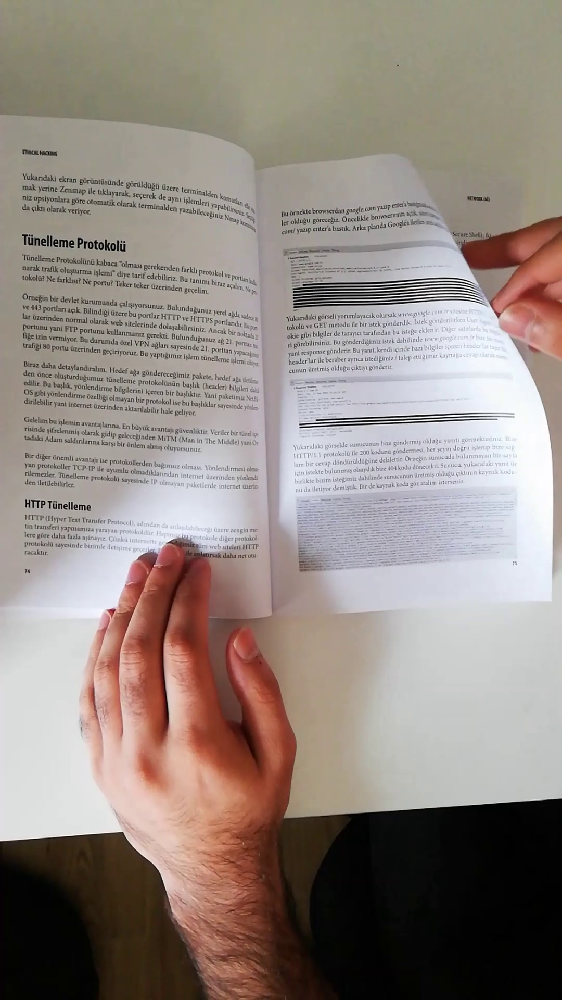
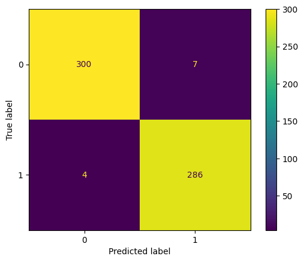
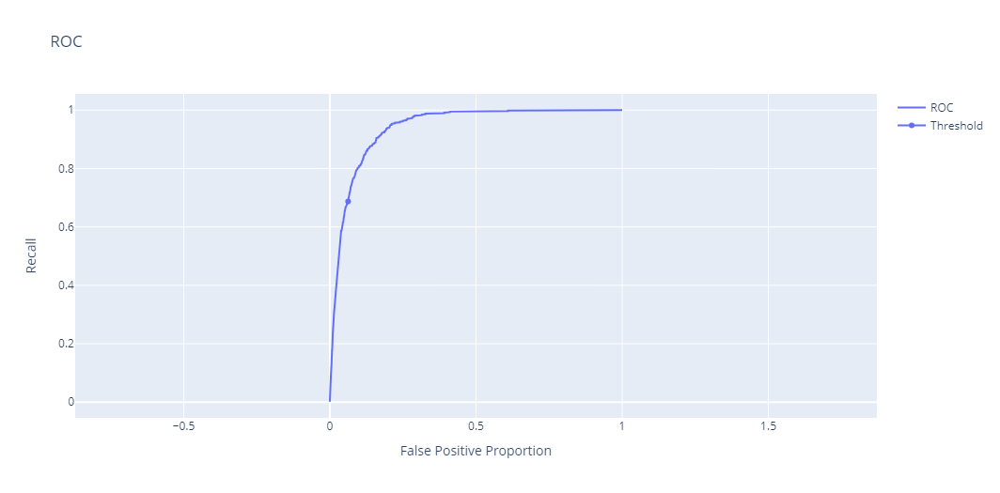
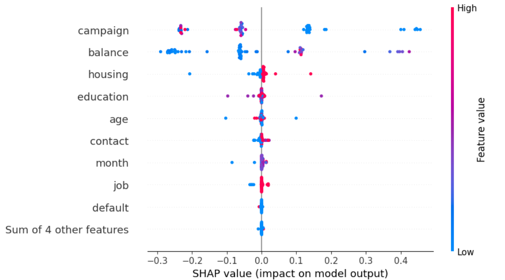
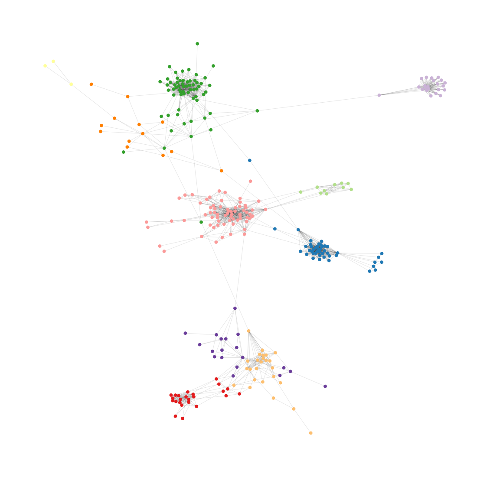

# Hi there my friend 👋

I am Rubén.

I am an Artificial Intelligence Engineer with a strong academic background in data science, telecommunications engineering, statistics, and data engineering.

I actively contribute to the field through my personal [blog](https://rubchume.medium.com/), where I share insights and informal experiences. With my passion and expertise in Python, machine learning, and cloud technologies, I strive to make a meaningful impact in the industry.

My daily tech stack: Python, Microsoft Azure ML, Terraform, PyTorch, Scikit-Learn, FastAPI, Pandas, Plotly.

Here you can find some of the projects I like to work on in my spare time or that I have done as part of some certification. Feel free to get inspired by them, fork them and contact me if you have any doubts or want to know a little more about the context (most of them are not thoroughly docummented since I do them mostly for myself).

Have fun.

## Projects free tour

Let me give you a brief summary of what you can find here, for free 😉

I have divided my portfolio into three types of projects: Data Science/Machine Learning, Data-oriented Software Engineering, and Software Engineering (in general).
Here you have the list of all my projects:
- [Data Science/Machine Learning](#data-science-projects)
  - [Reinforcement Learning Marketing User Flow optimization](#reinforcement-learning-marketing-user-flow-optimization)
  - [Voice Cloning and Classification](#voice-cloning-and-classification)
  - [Flip page CNN detector (Microsoft Azure MLOps)](#flip-page-cnn-detector-microsoft-azure-mlops)
  - [Bank Marketing Campaign XGBoost Modeling](#bank-marketing-campaign-xgboost-modeling)
  - [Job candidates ranking (Word2Vec)](#job-candidates-ranking-word2vec)
  - [Stock Data Analysis and Trading Strategy](#stock-data-analysis-and-trading-strategy)
- [Data-oriented Software Engineering](#data-oriented-software-engineering-projects)
  - [Facebook Friend Network Analyser](#facebook-friend-network-analyser)
  - [Picture Anonymiser](#picture-anonymiser)
  - [Medium web scraper](#medium-web-scraper)
  - [Whatsapp Analyser](#whatsapp-analyser)
- [Software Engineering](#software-engineering-projects)
  - [Notion API Manager](#notion-api-manager)
  - [Terraform AWS Examples](#terraform-aws-examples)

### Data science projects

#### [Reinforcement Learning Marketing User Flow optimization](https://github.com/rubchume/ReinforcementLearningUsers)

- Found best strategy for maximizing user subscription success rate in a marketing user funnel of a digital company by training a reinforcement learning algorithm on real user data.
- Evaluated the performance of the agent numerically and with expressive visualizations.
- Defined a process for handling scarcity of samples combined with many variables by leveraging Naive-Bayes proability estimation.

#### [Voice Cloning and Classification](https://github.com/rubchume/VoiceCloningFakeAudioDetection)
- Used an open source voice cloning model for *one-shot* cloning of voices using just a sample of one recorded sentence.
- Trained classification model for distinguising between cloned and real voices with a highly unbalanced dataset and achieving high accuracy.
- Performed the massive training and classification on compute clusters with GPU by using Microsoft Azure ML jobs.

#### [Flip page CNN detector (Microsoft Azure MLOps)](https://github.com/rubchume/FlipPageDetectorCNNAzure)
- Designed and trained a CNN neural network for classifying book pages being flipped or not with more than 98% F1 test score
- Trained it with GPU compute instance in Microsoft Azure, and PyTorch Lightning framework
- Deployed the model to Microsoft Azure ML batch and real time endpoints with the help of MLFlow framework

#### [Bank Marketing Campaign XGBoost Modeling](https://github.com/rubchume/BankMarketingCampaignXGBoostModeling)
- Analyzed data (demographic, financial and data related to marketing) from a marketing campaign where a European bank institution was selling a term deposit, performing Exploratory Data Analysis, binary classification modeling and evaluation of metrics.
- Used XGBoost to predict the success of the campaign given the customer’s available data.
- Performed feature engineering, fine tuning of model hyperparameters and adjusted the decision threshold, achieving a recall of more than 70% and a precision of 50% for a very imbalanced dataset (only 7% of customers bought the term deposit).

#### [Job candidates ranking (Word2Vec)](https://github.com/rubchume/JobCandidatesRankingWord2Vec)
- Created an algorithm to rank potential job candidates based on two criteria: search term and similarity to a candidate (based on job title, location and number of connections) that is manually highlighted as an ideal candidate.
- Used word embedding algorithms (Word2Vec and FastText) for computing the job title similarity and a geographic API for handling closeness of location.

#### [Stock Data Analysis and Trading Strategy](https://github.com/rubchume/StockDataAnalysis)
- Performed time series forecasting of stock data with SARIMAX and Simple Exponential Smothing models
- Created a trading strategy that makes use of previous forecasts using the Backtrader framework and Bollinger Bands as technical indicator

### Data-oriented Software Engineering projects

#### [Facebook Friend Network Analyser](https://github.com/rubchume/FacebookFriendNetworkAnalyzer)

- Developed a desktop application for **web scraping** and performing **social network analysis** of your personal Facebook friend network revealing insights and interesting facts you might not know yet.
- Combined different technologies like Selenium, NetworkX, Plotly, Electron and Django for creating the complete application.

Read more about it in this [Medium article](https://medium.com/analytics-vidhya/read-your-network-of-friends-in-facebook-by-scraping-with-python-a012adabb713).

#### [Picture Anonymiser](https://github.com/rubchume/PictureAnonymizer)

- Developed web application for uploading and blurring faces in images.
- Combined technologies like Django, Google Cloud Vision, Google Cloud Storage and Heroku to implement and deploy the full stack application.
- It can serve as a working starting point for more complex applications.

#### [Medium web scraper](https://github.com/rubchume/MediumScraper)

- Built a fast web scraper for massive download of tens of thousands of Medium articles in a few minutes, filtered by search term and additional critieria, so a machine learning company could train NLP models on them.
- Leveraged Python modern packages and capabilities as **Selenium**, **BeautifulSoup**, **multithreading** and **queues**.

#### [Whatsapp Analyser](https://github.com/rubchume/WhatsappAnalyzer)

- Designed and implemented a web app for analyzing how warm or cold relationships are between members a Whatsapp group chat by using Markov processes and linear algebra.
- Results were shown in expressive and easy to interpret visualizations so surprising insights are clear right away.
- Deployed on Heroku.
- Used modern technological stack: Django, Plotly, Dash, Pandas, Numpy.

### Software Engineering projects

#### [Notion API Manager](https://github.com/rubchume/NotionApiManager)

- Created a tool for seamlessly perform operations in Notion from Python in an object-oriented programming manner, making use of Notion's web API.
- It allows creating new pages and consuming existing information with just a few lines and integrates it with Pandas.
- Development flow integrated in a full CI/CD pipeline (Gitlab CI Pipeline): runs unittests, generates documentation with Sphinx and pushes it to ReadTheDocs and publishes the package to PyPI.

#### [Terraform AWS Examples](https://github.com/rubchume/TerraformAWSexamples)

- Collected common Terraform (Infrastructure-as-Code) configurations from different data analysis projects that can be deployed on AWS right away,
- being an excellent example of how modularity is used to design complex infrastructure
- and serving as starting points you can then customize to your own needs.

## Contact me
Contact me if you wish at rubchume@gmail.com.

It might take a few days until I reply.

**Have fun**
